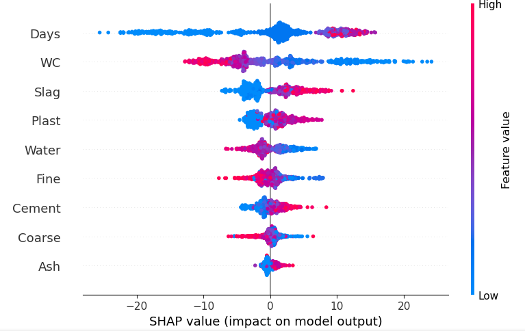
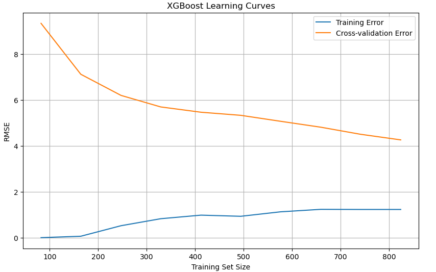
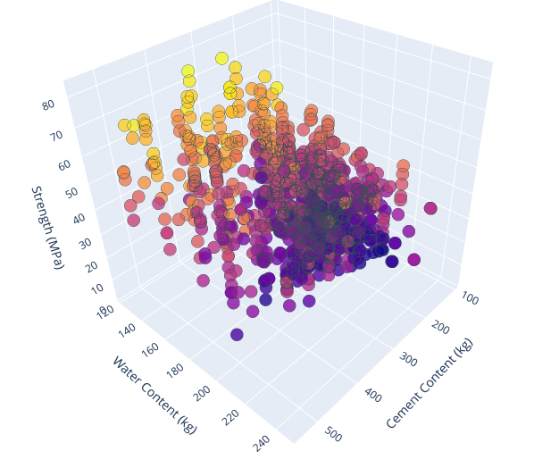
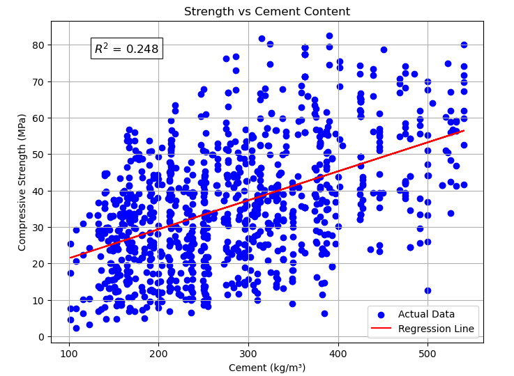

# Concrete Strength Prediction

## Overview
This project focuses on predicting the compressive strength of concrete using machine learning. The model is trained on publicly available concrete mixture data, leveraging feature analysis and multiple regression algorithms. After comparing different approaches, **XGBoost** was chosen due to its superior performance in terms of both training and validation accuracy.

## Data Processing
- **Data Collection**: Raw data was sourced from online datasets in CSV format.
- **Data Refinement**: Filtering and preprocessing were applied to clean and refine the dataset.
- **Feature Engineering**: Identified key factors impacting concrete strength using feature importance analysis and visualization.

## Feature Importance Analysis 📊

- **Top Influencing Factors**: Curing time (Days), Water-Cement ratio (WC), and Slag content.
- SHAP analysis confirmed the relative importance of these features in predicting strength.

## Model Training and Selection
- **Initial Model**: **RandomForestRegressor** was used for baseline prediction.
- **Optimization**: Hyperparameter tuning was performed for better accuracy.
- **Model Comparison**: 
  - **Random Forest** showed good performance but had higher error.
  - **XGBoost** demonstrated lower training and validation error, making it the preferred choice.
- **Pipeline Implementation**: A pipeline was created for simplifying data preprocessing and model training.

## Model Performance Highlights ⭐

- **Training RMSE**: 1.2 MPa
- **Test RMSE**: 4.2 MPa
- **Explains ~85% of strength variation**
- **Balanced learning curves indicate well-fitted model**

## Insights from Visualizations
### 3D Visualization of Key Relationships

- Displays interaction between Water content, Cement content, and Strength.
- Higher cement content generally increases strength, but water content must be optimized.

### Cement Content vs Strength Correlation

- A positive correlation (R² = 0.248) exists, but strength is influenced by multiple factors.

## Model Enhancement
- **Validation with New Data**: Model performance was assessed using fresh test samples.
- **Robustness Improvement**: Additional datasets were incorporated to refine and enhance predictive accuracy.

## Conclusion
This study successfully developed an **XGBoost-based machine learning model** for predicting concrete compressive strength. The model leverages **data-driven feature analysis** to make accurate predictions and has been refined with additional datasets for improved robustness.

---
📌 **Future Work**: 
- Exploring deep learning techniques.
- Expanding the dataset for better generalization.
- Implementing real-time prediction capabilities.

**Developed with 🏗️ Machine Learning & Data Science**

